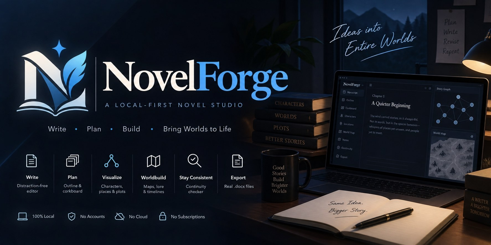
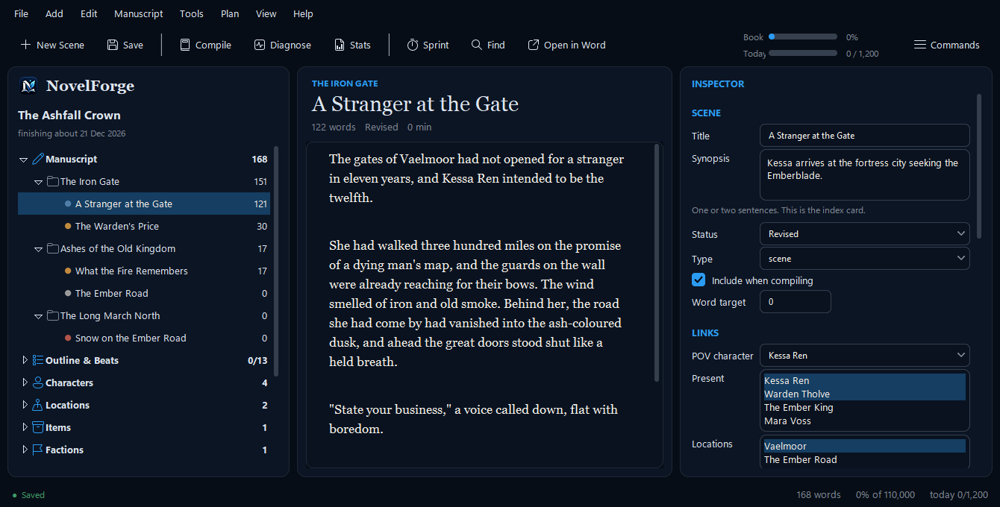

<p align="center">
  
</p>

# NovelForge

**A local novel-writing studio that writes real Word documents, not a
database you hope to export from someday.**

[](LICENSE)
[](#requirements)
[](#requirements)
[](#where-your-work-lives)
[](#support-novelforge)
[](https://sideeffects69.github.io/NovelForge/)

Every single thing NovelForge creates — every scene, every character sheet,
every map — is a real Microsoft Word document sitting in a folder on your own
disk. Nothing is uploaded, there is no account, and it works with the network
unplugged. If NovelForge vanished tomorrow, your novel would still be sitting
there in Word format, exactly as readable as it is today.

It bundles what a novelist otherwise pieces together from five different
apps — a Scrivener-style binder and corkboard, nine outline frameworks, a
timeline, a continuity checker that reads your actual prose, a fantasy map
maker with one-click procedural worlds, and offline prose diagnostics — into
one tool that opens in about a second and never asks you to sign in.

**To start it: double-click `Write.bat`.**

<p align="center">
  <br>
  <em>The app itself (Premium theme): binder, editor, inspector.</em>
</p>

---

## Contents

- [The first five minutes](#the-first-five-minutes)
- [The website](#the-website)
- [Where your work lives](#where-your-work-lives)
- [Features at a glance](#features-at-a-glance)
- [Writing](#writing)
- [The reference sheets](#the-reference-sheets)
- [Planning](#planning)
- [The story graph](#the-story-graph--ctrlg)
- [Drafts — trying it another way](#drafts--trying-it-another-way)
- [Idea inbox](#idea-inbox--ctrli)
- [Research that is attached to something](#research-that-is-attached-to-something)
- [Maps](#maps--ctrlm)
- [Corkboard](#corkboard--ctrlk)
- [Compiling](#compiling)
- [Diagnostics](#diagnostics)
- [Drafting anyway](#drafting-anyway)
- [Statistics](#statistics)
- [Not losing your work](#not-losing-your-work)
- [Keyboard shortcuts](#keyboard-shortcuts)
- [If the power goes out](#if-the-power-goes-out)
- [Verify this project (F4)](#verify-this-project-f4)
- [Importing work you already have](#importing-work-you-already-have)
- [Requirements](#requirements)
- [Credits](#credits)
- [Support NovelForge](#support-novelforge)
- [Contributing](#contributing)

---

## Features at a glance

### While you write

- Real `.docx` files, one per scene — open and edit in Word or in-app; after editing in Word, press F2 (File → Reload from Word) and NovelForge picks up the change
- Focus mode, distraction-free mode, ghost mode (hides your text as you type, for perfectionists), typewriter scrolling, sprint timer
- Live spelling/grammar marks and completion, tuned to *your* manuscript's names and invented words, not a generic dictionary

### Planning & structure

- Nine outline frameworks built in — Three-Act, Save the Cat, Snowflake, Seven-Point, Story Circle, Hero's Journey, Romancing the Beat, Mystery/Crime, Freytag — switch freely, nothing is lost
- Corkboard with drag-to-reorder index cards, colour-coded by status
- Free-text timeline that sorts invented calendars correctly
- Scene/sequel structure per Dwight Swain, with a value-shift check (F8)
- Real Word reference sheets for characters (~90 fields, including the Ghost/Lie/Truth/Want-vs-Need arc framework), locations, items, factions and plot threads — fill in what serves the story, the app reads back whatever you typed

### World & story intelligence

- The **story graph** (Ctrl+G): mines your actual prose for character/place/object mentions and builds a living map of who was where, cross-checked against a 15-point continuity checker
- "What depends on this scene?" — see what breaks before you delete something
- One-click **Story Bible** generation, always current because it's built from the manuscript itself
- Idea inbox that suggests where a stray thought belongs, by matching it against your own scenes and characters

### Maps and worldbuilding

- One-press **"Surprise Me"** procedurally generated fantasy worlds — coastlines, kingdoms, regions, seas, rivers, roads, dozens of named settlements — reproducible by seed
- Editable, per-culture name generation (settlements, realms, regions, seas and rivers can each sound different)
- Hand-drawn tools too: freehand coastlines, 13 terrain types, 20 pin types, layers, 5 art styles
- Pins link straight to your Location sheets; export to PNG, SVG, or Word with a legend

### Never losing your work

- Atomic writes, per-document version snapshots, verified zip backups, and a crash-recovery journal that asks before it restores anything
- Full undo/redo for structural edits (delete a chapter, get it back — files included)

### Offline diagnostics

- ~20 prose checks (adverbs, filter words, passive voice, pacing, word echoes, reading level) — all heuristic, all local, nothing rewritten for you
- A five-type writer's-block diagnostic ranked by actual prevalence, because the fixes contradict each other
- A pace/streak/deadline dashboard that separates words *added* from words *net* of revision

No AI, no telemetry, no login, no subscription. MIT licensed.

---

## The first five minutes

1. Double-click `Write.bat`. (The very first time it installs two small Python
   libraries for you - `python-docx` and `Pillow` - which needs the internet once.)
2. **File → New Novel...** Give it a title and a word target. Press OK.
   It creates about thirty Word documents in a few seconds.
3. In the binder on the left, open **Manuscript → Chapter One → Opening Scene**.
4. Type. It saves itself.

That is the whole loop. Everything below is detail you can read when you need it.

---

## The website

**[sideeffects69.github.io/NovelForge](https://sideeffects69.github.io/NovelForge/)**
— features, the map maker, an honest comparison with Scrivener, Atticus and
others, a FAQ, download help and a changelog, if you'd rather look before you
download. It's a website *about* the app, not the app itself: NovelForge can't
run in a browser (Tkinter doesn't work there, and it needs your real filesystem),
so there is no online version to try without installing anything. The pages are
generated from `tools/site/` by `python tools/build_site.py` and published from
`site/`.

---

## Where your work lives

`Projects\<Your Novel>\` — open it in Explorer any time (**File → Open Project
Folder**). Nothing is hidden in a database.

```
Projects\The Salt Road\
├── project.json              ordering, links, word counts, targets
├── 00 Manuscript\            one .docx per scene, inside chapter folders
├── 01 Outline\               beat sheet, premise & logline, reverse outline,
│                             generated Story Bible
├── 02 Characters\            one sheet per character
├── 03 Locations\
├── 04 Items\
├── 05 Factions\
├── 06 Plot Threads\
├── 07 World Bible\           magic system, politics, religion, culture,
│                             technology & economy, calendar, nature, history
├── 08 Timeline\              chronological event table
├── 09 Research\
├── 10 Notes\                 Why Compass, revision checklist, dialogue rules,
│                             writer's block diagnostic, Fix Later queue
├── 11 Publishing\            query letter, synopsis, beta questionnaire,
│                             submission tracker
├── 12 Continuity\            established facts, for book two
├── 13 Maps\                  hand-drawn maps + PNG/SVG/Word exports
├── _Compiled\                >>> THE WHOLE STORY IN ONE DOCUMENT <<<
├── _Drafts\                  alternate versions of individual scenes
├── _Snapshots\               version history, per document
└── _Backups\                 verified .zip of everything
```

`project.json` holds only metadata — ordering, which character is in which
scene, word counts, your targets. All the *words* are in the .docx files. If
this program vanished tomorrow, your novel would still be sitting there in
Word format.

---

## Writing

**In the app.** Click a scene and type. Autosave runs 30 seconds after you stop
typing, and again whenever you click away. `Ctrl+S` forces it.

**In Word.** Select anything and press **Open in Word** (or double-click it in
the binder). Write there instead if you prefer. When you come back, the app
notices the file changed and re-reads it — or use **File → Reload from Word** to
force it.

Both directions work. Use whichever suits the day.

### Focus tools

| | |
|---|---|
| **F11** Focus mode | Dims every paragraph except the one you are in. |
| **F12** Distraction free | Hides the side panes. Just the page. |
| **Ghost mode** (View menu) | Hides your text as you type it, so you cannot stop to edit. For perfectionism — see the block diagnostic below. |
| Typewriter scrolling | Keeps the line you are typing near the middle of the window. |
| **F6** Sprint | A countdown that reports words written and words per minute. |

---

## The reference sheets

Characters, locations, items, factions and plot threads each get a Word document
made of two-column tables — field name on the left, your answer on the right.
The character sheet has about ninety fields across eleven sections, including
the arc framework: **the Ghost** (the wound), **the Lie** they believe, **the
Truth** they need, **the Want** versus **the Need**, and the fatal flaw that
connects them.

Fill in what serves the story and ignore the rest. Deleting a row in Word is
easier than wishing you had asked the question.

Whatever you type comes back into the app automatically. The middle pane shows
every filled field so you can check a detail without opening Word.

If a template gains fields later, **Tools → Rebuild This Sheet from Template**
adds them and keeps everything you have already written.

---

## Planning

**Ctrl+L** opens the outline. Pick a framework and fill in each beat.

Nine are built in: Three-Act (with K.M. Weiland's percentage markers), Save the
Cat (all fifteen beats), Seven-Point (Dan Wells — fill it in backward, starting
with the resolution), Story Circle (Harmon), Hero's Journey (Vogler), Romancing
the Beat (Hayes), Mystery/Crime, Freytag, and the Snowflake Method (a ten-step
process rather than a beat sheet).

**Switch between them freely.** Each framework's answers are archived
separately, so trying Save the Cat and going back to Three-Act loses nothing.

Each beat shows the word position it should land at, calculated from your target
length — so "your midpoint should be around word 45,000."

**Ctrl+T** opens the timeline. Dates are free text — `Day 3`, `1247`, `the
autumn before` — and are sorted by whatever numbers they contain, so invented
calendars work fine.

### Scene structure

Each scene's inspector follows Dwight Swain's pattern:

- A **scene** has a Goal, a Conflict and a Disaster.
- A **sequel** has a Reaction, a Dilemma and a Decision.

Alternating them is what creates pace. There is also a **value shift** — the
emotional state at the start and at the end. If those two are the same, nothing
happened, and **F8** (Scene Craft Check) will say so.

---

## The story graph  (Ctrl+G)

Most writing tools treat a novel as a list — scenes in order, characters in a
sidebar. But the questions that actually keep you up at night are network
questions. *Who was in the room? What did this scene establish? If I cut chapter
eight, what stops making sense?*

So NovelForge reads your whole manuscript and builds a map of it: every
character, place, object and thread, and every scene each one appears in. It
finds them two ways — links you set by hand, **and** names it finds in your
actual prose. That second one is how it notices what you forgot to link.

It reads each scene once and remembers the result, so opening this is instant
after the first time.

### Continuity check  (F10)

Fifteen checks, all run on your own machine:

- Links pointing at characters you deleted
- Someone in the prose who is not linked to the scene — and the reverse
- A POV character who is never named in their own scene
- Story dates running backwards
- A character appearing before they were born or after they died
- **Plot threads that stop instead of resolving** — the most common reader complaint
- Objects that appear exactly once (Chekhov's problem)
- Two characters whose names a reader will confuse
- `[bracket tags]` you left in the manuscript
- Scenes where the emotional value does not change
- A major character who first appears 60% in

Findings are sorted **serious / worth a look / minor**, and every one is phrased
as a question rather than a rule. A deliberate flashback trips half of these
checks, and that is fine — the tool tells you what it noticed, you decide.

### What depends on this scene?

Right-click any scene → **What depends on this?**

It shows what that scene *introduced* and which later scenes assume it. Delete
the scene and those lose their setup.

You do not have to remember to check. **When you delete a scene, the warning
appears in the confirmation box** — before you commit, not after.

### Relationship timeline

A static "who knows whom" web tells you two characters met. This shows you
*when*, across the whole book:

```text
  Ada Vane + Corwin Vale       |##############        ##############|   4
  Mara Fenn + Ada Vane         |      ###############     ########  |   3
```

Together at the start, a gap in the middle, back at the end. Gaps are where a
relationship goes quiet — which is either your structure working, or a thread
you dropped.

### Ask your story

A question box that answers from your own book:

- *How long is the book?*
- *Where does Ada first appear?*
- *Who does Ada meet?*
- *What happens in chapter 3?*
- *What is unresolved?*
- …or any word, which falls back to a full-text search

**This is not a chatbot and there is no AI in it.** It recognises the shapes of
question a story map can actually answer and looks them up. That means it cannot
invent a fact, never needs the internet, and answers instantly.

### Story bible, in one click

**Manuscript → Write Story Bible** generates a complete Word reference: the book at a
glance, every character with their full sheet and first/last appearance, every
location, item, faction and thread, who knows whom, your structure and beats,
every chapter and scene with synopses, the chronology, and your research index.

Generated from the manuscript itself, so it is never out of date. Regenerate it
any time — it is written whole each time and holds nothing your project does not
already hold.

---

## Drafts — trying it another way

Right-click a scene → **Drafts…**

Write a second version of a scene without copying the project. Name it, write
it, switch back and forth. Neither version is ever lost.

The version you are in is the real document, so compiling, word counts, search
and backups all keep working normally and always use whichever draft you are
currently writing in.

This is different from **Versions…**, which is automatic per-save history. Drafts
are deliberate alternatives you choose between.

---

## Idea inbox  (Ctrl+I)

Ideas arrive while you are writing something else. Stopping to file them costs
you the sentence you were in the middle of.

So: **Ctrl+I, type it, Enter.** Done. Decide later.

When you come back, select an idea and NovelForge offers a shortlist of where it
might belong — worked out by matching the idea's words against your scene
titles, synopses and character sheets. Plain word overlap, with the score shown,
so you can see why it suggested what it did. File it against a scene or a
character, turn it into a research note, or throw it away.

---

## Research that is attached to something

Right-click a note → **Link to scenes and characters…**

A research note in a folder is a note you will never find again. Link it to the
scenes and people it is *for*, and it shows up on them — in the inspector, in
the story bible, and in the dependency map.

---

## Maps  (Ctrl+M)

A drawing tool for the world in your head. Continents, kingdoms, city plans,
dungeons, treasure maps.

**Press "Surprise Me"** for a whole world in one click — coastlines that wander
into bays and headlands, mountain ranges, forests and deserts, rivers that run
from the highlands to the sea, roads that follow the land (never through the
water), and dozens of named settlements, built from the system's own randomness.
Press it again for a different world. Every world records its seed, so one you
like can be regenerated exactly - names included; **Generate...** opens the same
thing as a dialog, if you want to choose the preset, size and counts yourself
rather than leave them to chance.

**The window** is a tool rail (select, draw terrain, freehand, pin, label, erase,
pan), a palette for terrain, pin type and layers, the map lying on a desk, and a
properties panel. **Export** and **More** menus hold everything else. Zooming
shows at once and redraws when you stop, so a busy map stays smooth.

**Names come from editable lists, not a fixed dictionary.** Settlements,
kingdoms, regions, seas and rivers can each be given their own naming style —
so a capital doesn't sound like its villages, and an ocean doesn't sound like
either. **Edit Names** opens the list (`Name Styles.json`, in the map's own
folder) so you can add a style or replace the syllables with your own
invented language.

**Draw a coastline by hand:** pick **Freehand**, choose *Land / coast*, hold
the left button and draw a rough blob. Let go. The line is smoothed, filled,
and given the pale shallows and ripples that make a map look hand-drawn rather
than like a diagram. Prefer straight edges? Use **Draw terrain**, click each
corner, then double-click to close it.

**Thirteen terrain types.** Filled areas: land, sea, forest, desert, marsh, ice,
region. Drawn lines: mountain range, hills, river, road, wall, route.

Mountains and hills are scattered *along* the line you draw — draw the spine of
the range and peaks appear over it. Forests, deserts and marshes fill the area
you enclose with trees, stippling or reeds. Rivers taper: thin at the source,
wider at the mouth, so draw them downhill.

**Twenty pin types** — capital, city, town, village, castle, tower, temple,
port, ruin, cave, dungeon, mine, camp, bridge, inn, battle, danger, treasure,
landmark, portal — each with its own drawn glyph, not a coloured dot.

**Pins link to your Location sheets.** Right-click a pin → *Link to a Location
sheet*, then double-click the pin to open that sheet in Word. The map and the
worldbuilding notes stay connected, which is the whole point.

**Five styles:** Parchment (aged paper, sepia ink), Ink (clean black on white,
prints well), Dark atlas, Treasure map, and Print (black and white, made for book
interiors). Layers let you keep political
borders separate from terrain and hide them for a clean geography map.

**Export** (the menu at the top right) to PNG, to SVG (scalable, stays sharp at
any size), or a Word document - a .docx with the map image plus a legend table of
every pin and named area. Place names carry a halo, so they stay readable where
they cross a coastline or a river.

There is also a **place name generator** (Plan menu) with five flavours:
northern, southern, elvish, harsh and plain-English compound names.

---

## Corkboard  (Ctrl+K)

Every scene as an index card, grouped by chapter, coloured by status.

- **Drag a card onto another** to drop it in front of that one.
- **Drag a card onto a chapter heading** to move it into that chapter.
- **Double-click** to edit the synopsis, status, POV and scene/sequel fields.
- **Cycle status** steps through the five statuses — quick for triaging.
- A card showing **⁙?** is not linked to any plot thread.

This is the fastest way to outline, because you can see the shape of the whole
book while you type. Any card whose synopsis you cannot write in one sentence is
a card that does not yet know what it is for.

**Character Relationships** (also in the Plan menu) draws your cast as a web,
with an edge wherever two characters share a scene and thickness by how often.
A character who shares scenes with nobody is either a device or a missed
opportunity; a protagonist who never shares a scene with the antagonist needs a
very good reason.

---

## Compiling

**F5** gathers every scene into **one Word document** in `_Compiled\`, in
standard manuscript format:

- US Letter, one-inch margins, 12pt, double spaced, half-inch first-line indent
- Title page with your contact block and a rounded word count
- Running header `Surname / TITLE / page` from page two
- Each chapter starting on a fresh page
- `#` between scenes, `THE END` at the end
- Optional table of contents (right-click it in Word and choose Update Field)

Italics and bold survive; everything else is normalised. That is the point of
compiling.

**Shift+F5** recompiles with the same settings, no dialog.

A "working draft" mode prints each scene's synopsis above it — useful for you,
never send it out.

Also available: plain text export, and a **treatment** (every synopsis in
reading order, which reads like a pitch document).

---

## Diagnostics

**F7** analyses the current scene — or a whole chapter, or the whole book.
Roughly twenty checks:

- `-ly` adverbs, filler and hedging words, filter words (*she saw*, *she felt*)
- Passive constructions, stock phrases, decorated dialogue tags
- Action verbs used as speech tags — you cannot *smile* a sentence
- Comma outside the closing quote, capitalised tag after a comma, unbalanced quotes
- Sentence rhythm, over-long sentences, runs of identical length
- Word echoes, repeated paragraph and sentence openings
- Dialogue-to-narration ratio, runs of the same texture
- Which of the five senses appear
- Reading ease and grade level
- Leftover `[bracket tags]`, double spaces, doubled words

**Every one of these is a heuristic and some will be wrong.** They are worded as
observations, not corrections, and nothing is ever rewritten for you. Your voice
beats every rule in the list.

**Tools → Word Frequency** shows your crutch words, which is often more useful
than all of the above.

**Manuscript → Write Reverse Outline** builds an outline *from what you actually
wrote*. Comparing it against your planned outline is the fastest structural
edit available.

---

## Drafting anyway

Type `[check the tide timing]` and keep going. Never stop to research
mid-sentence.

**Manuscript → Sweep [Fix Later] Tags** collects every bracket tag in the book
into one document with its surrounding context. Do them in a batch when you are
in editing mode.

### Writer's block diagnostic

**Tools → Writer's Block Diagnostic** asks five yes/no questions in order of how
common each cause is, and the first *yes* decides — because the fixes contradict
each other.

| Cause | Share | The fix |
|---|---|---|
| Physiological | 42% | Rest. Not discipline. Pushing makes it worse. |
| Motivational | 29% | Low-stakes drafting nobody will read. |
| Cognitive | 13% | Separate drafting from editing. Ghost mode. |
| Behavioural | 11% | One fixed time, one place, watch the streak. |
| Composition | 5% | Say it out loud. Dictate it (Win+H). |

Most blocks are the first one, and it is the only one where trying harder
actively hurts.

---

## Statistics

**F9** shows the dashboard: progress against target, streak, pace, projected
finish date, a 30-day sparkline, per-chapter breakdown, POV balance, and plot
thread coverage with the largest gap for each — a thread absent for many
consecutive scenes reads to a reader as abandoned.

**On deletions.** A revision day where you cut 800 words and write 600 is real
work, and reporting "−200" would be both discouraging and wrong. So two numbers
are kept: **added** (what you typed) and **net** (what the manuscript gained).
Daily targets measure `added`; progress toward the book's total uses `net`.

---

## Not losing your work

Four independent layers:

1. **Atomic writes.** Every file is written to a temporary name and then swapped
   into place. A crash mid-save cannot leave a half-written file — you get
   either the old one or the new one.
2. **Snapshots.** Every scene is copied into `_Snapshots\` before each save.
   Right-click a scene → **Versions...** to look at or restore any of them.
   Restoring keeps the current version too, so it is never destructive.
3. **Backups.** `Ctrl+B` zips the whole project into `_Backups\`, then reopens
   the zip and verifies its checksums before reporting success. Automatic on
   open and on close. Restoring always extracts to a *new* folder — it will
   never write over what you are working on.
4. **A rolling `project.json.bak`**, in case the manifest itself goes wrong.

Both snapshots and backups prune themselves (25 backups, 40 versions per
document by default — change it in Preferences).

**Some specific things that cannot happen**, because each was found and fixed:

- Two characters with the same name cannot share one sheet — the second gets its
  own file.
- Re-creating a deleted scene cannot overwrite the prose file you chose to keep.
- Moving a scene to another chapter moves its document too, so deleting the old
  chapter cannot destroy prose that now belongs elsewhere.
- A document that is locked by Word or still downloading from OneDrive is never
  mistaken for an empty one. Word counts are not zeroed and sheets are not
  rewritten from a failed read.
- A scene that cannot be read is **reported** at compile time, never silently
  dropped from the manuscript.
- A backup that fails its checksum test is deleted rather than left in the list
  looking like a backup.
- Pressing Enter once in the editor makes a real paragraph, so verse, epigraphs
  and letters keep their line breaks.

### OneDrive

Your project sits inside a OneDrive folder, so two other programs can grab a
file while the app is writing it: the sync client, and Word. Every write retries
with a backoff, and if a file is genuinely locked you get a plain sentence
telling you to close it in Word — never a silent failure or a corrupted file.

If you edit the same novel on two machines, let OneDrive finish syncing before
opening it on the second one. Look for the green tick.

---

## Keyboard shortcuts

| | | | |
|---|---|---|---|
| `Ctrl+S` | Save | `Ctrl+F` | Find in project |
| `Ctrl+N` | New scene | `F5` | Compile |
| `Ctrl+Shift+C` | New chapter | `Shift+F5` | Quick compile |
| `Ctrl+Shift+N` | New novel | `F6` | Sprint |
| `Ctrl+O` | Open novel | `F7` | Diagnose scene |
| `Ctrl+B` | Back up now | `F8` | Scene craft check |
| `Ctrl+L` | Outline & beats | `F9` | Statistics |
| `Ctrl+T` | Timeline | `F11` | Focus mode |
| `Ctrl+M` | Map maker | `F12` | Distraction free |
| `Ctrl+K` | Corkboard | `F2` | Reload from Word |
| `Ctrl+G` | Story graph | `F4` | Verify project |
| `Ctrl+I` | Idea inbox | `F10` | Continuity check |
| `Ctrl+=` / `Ctrl+-` | Text size | `Ctrl+Shift+P` | Command palette |

In the binder: right-click for a context menu, double-click to open in Word,
or just start typing a name to jump to it.

**Can't remember where something lives?** Press `Ctrl+Shift+P` and type what you
want - "story graph", "backup", "theme" - then Enter. It searches every command
in every menu, and shows the shortcut beside each one.

---

## If the power goes out

Two safety nets, not one.

**Autosave** writes the editor into its Word document every thirty seconds.
That still loses up to thirty seconds — and the paragraph you lose is always
the one that was going well.

So there is also a **journal**: a second and a half after you stop typing,
NovelForge writes what is in the editor, where the caret is and which scene
you are in to a small file next to the settings. It is plain text, not a Word
document, so it costs a few milliseconds.

If Windows restarts, the power fails or the app is force-closed, the next start
says:

```text
NovelForge did not close properly last time.

There is unsaved writing for 'The Reckoning' from 2026-07-27 at 21:14.

On disk:    1,204 words
Recovered:  1,338 words

Restore the recovered version?
```

Three things it deliberately will not do:

- **It never restores without asking.** Silently replacing your prose with a
  version you have not seen is worse than losing a minute of it.
- **It keeps the other version either way**, as a document next to the original.
- **It refuses when it is not sure.** If the document changed in Word after the
  journal was written, the journal is stale and is discarded rather than used —
  restoring it would destroy newer work.

The journal lives beside the settings, not inside the project, so it survives
the project folder going away — which is one good way to crash a program.

On a normal start it quietly puts you back in the scene you were writing, at
the line you left off.

## Undo covers more than typing

The editor has always had its own undo. Now so does everything around it —
renaming a chapter, moving a scene, deleting a character, changing a field in
the inspector.

| Where you are | `Ctrl+Z` does |
|---|---|
| In the editor | Undo typing (as before) |
| Anywhere else | Undo the last change to the project |
| Either | `Ctrl+Alt+Z`, or **Edit → Undo**, always undoes the project change |

The Edit menu names it — *"Undo delete the chapter 'Doomed'"* — so you know what
is about to come back before you press it.

**Deleting is no longer a one-way door.** Choosing "delete the files too" now
moves the documents to a `_Trash` folder inside the project instead of erasing
them, and undo puts them back where they were, prose intact. Nothing in `_Trash`
is ever removed automatically.

## Saves are verified before they land

Every document is written to a temporary file first, checked that it is a valid
Word file, and only then allowed to replace the real one. If the check fails —
the disk filled, the process was killed mid-write, an antivirus scanner grabbed
the handle — the save is abandoned and **the previous version is left exactly as
it was.**

## Verify this project (F4)

One button. It reports what is in the project, what is broken, and a score.

```text
WHAT IS HERE
       3  chapters      5  scenes       3  characters
       3  locations     1  plot threads

PROBLEMS  (2)
  ! 'The Reckoning' links to something deleted
  ! Location 'Iron Keep Ruins' has no document on disk

WARNINGS  (2)
  - 'Quiet Water' is dated before the scene that precedes it
  - 2 chapters are called 'chapter two'

  HEALTH SCORE   82/100
  [#################################.......]
```

**Problems** are broken data — missing files, links to things that no longer
exist, duplicate ids, scenes orphaned from a deleted chapter, map pins pointing
at deleted places. Those are worth fixing.

**Warnings and minor notes** are opinions about the writing. A deliberate
flashback trips one. Nothing there is an order.

---

## A rule for anyone changing this code

> **Every new window, dialog, popup or panel must fit the screen it is opened
> on.** No control may end up clipped, off-screen, or behind the taskbar, at
> any resolution or any Windows display scaling. When content is taller than
> the space available, it scrolls.

In practice that means one thing: **never call `geometry()` directly.** Size
every window through `center_window()` in `novelforge/ui/widgets.py`, which

- asks Windows for the real work area (the screen *minus* the taskbar),
- allows for the title bar and border, which are not part of the size you ask
  for,
- shrinks the window to fit rather than letting it hang off the edge,
- centres it and clamps every edge back on screen,
- and sets a minimum size that is itself small enough to fit.

Ask for the size you actually want. On a 4K screen you get it; on a 1366×768
laptop it is quietly reduced to fit.

Any list that can hold more rows than are visible needs a scrollbar — use
`scrolled()` in `novelforge/ui/storyviews.py`.

Tests guard this: the GUI suite in `tests/` opens every window, the Map Maker
in every theme, and the main window at its smallest size and at a simulated 125%
display, and fails if any content is clipped, hidden or squeezed. The whole suite
(`python -m unittest discover -s tests -t .`, about five minutes) also uses every
menu command and button, tests the map engine and checks the website. It covers
three sizes rather than every one from 1024×768 up to 3840×2160, so treat other
sizes as a rule to check by hand (see `CLAUDE.md`).
`python tools/uishots/run.py` photographs the real windows if you want to look.

---

## Importing work you already have

Copy your existing `.docx` files into a chapter folder under `00 Manuscript\`,
then **Manuscript → Import Loose .docx Files**. Each becomes a scene with its
word count read in.

---

## Requirements

- **Windows 10 or 11.** (The engine is plain Python and could run elsewhere;
  the Tkinter UI has only ever been built and tested on Windows.)
- **Python 3.13 or newer.** Get it from [python.org](https://www.python.org/downloads/)
  (tick "Add python.exe to PATH" during install) or `winget install Python.Python.3.13`.
- Two packages, `python-docx` and `Pillow`. `Write.bat` installs them on the first
  run; to do it yourself: `pip install -r requirements.txt`
  — `python-docx` writes the Word files, `Pillow` renders the map images.
  Everything else — the GUI, the drawing, the diagnostics — is the Python
  standard library. Nothing else to install, no build step, no internet
  access needed once those two are on disk.

**To run it:** clone or download this repository, then double-click
`Write.bat`. It looks for Python at the usual install locations first and
falls back to whatever `python`/`pythonw` is on your `PATH`, so it works
however you installed Python. If it still can't find one, it says so instead
of failing silently.

**Changing the code?** See `CLAUDE.md` for the module map, the load-bearing
rules, and what's already built versus genuinely missing — this project is
built entirely through AI pairing, so that file is the only memory that
carries between sessions.

---

## Credits

The frameworks this tool encodes are other people's work, and worth reading
directly: K.M. Weiland on structure and character arcs, Blake Snyder on beats,
Dan Wells on the seven-point structure, Dan Harmon on the story circle,
Christopher Vogler and Joseph Campbell on the hero's journey, Gwen Hayes on
romance, Randy Ingermanson on the Snowflake Method, Dwight Swain and Jack
Bickham on scene and sequel, and William Shunn on manuscript format.

---

## Support NovelForge

NovelForge is free, MIT licensed, and always will be — no subscription, no
paywalled features, nothing held back. If it's useful to you and you'd like
to help keep it going, a donation is welcome but never expected.

<table>
<tr>
<td align="center" width="50%">

**PayPal**

[paypal.me/OmAbhyankar](https://paypal.me/OmAbhyankar)


</td>
<td align="center" width="50%">

**UPI** (India)

`abhyankarom10@ybl`


</td>
</tr>
</table>

Scan the UPI code with any UPI app (Google Pay, PhonePe, Paytm, BHIM, your
bank's app...), or enter the ID by hand. Either way — thank you.

---

## Contributing

Bug reports and feature ideas are welcome — [open an issue](../../issues/new/choose).
If you want to submit code, see `CONTRIBUTING.md` for the two rules that
matter and how to test a change by hand (there's no automated test suite
yet). `CLAUDE.md` has the module map if you want to understand the codebase
first — this whole project was built through AI pairing, so that file is
the closest thing it has to onboarding docs.
